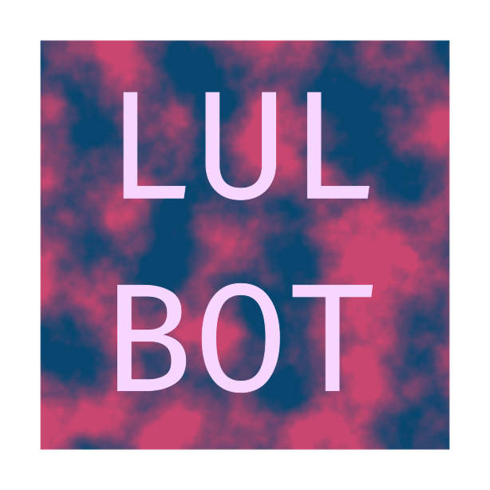

<h1 align="center">LULBOT</h1>
<p align="center">
  
  <br>
  <i>A Discord bot writted for your server</i>
  <br>
</p>
<hr>

## Documentation


### Prerequisites
- Install Node.js 12.x or higher
- Install ```nodemon``` (this is for development only)

### Setup
Before running this project you must create a ```.env``` file which should contains the following keys (This can be changed in the source code)
<br>
```
LUL_BOT_TKN=Your_Discord_Bot_token
TENOR_TOKEN=Tenor_token // this used for generating gifs
AIRTABLE_KEY=Airtable_key // this is currently used to store data for my CoD mobile loadouts
```
